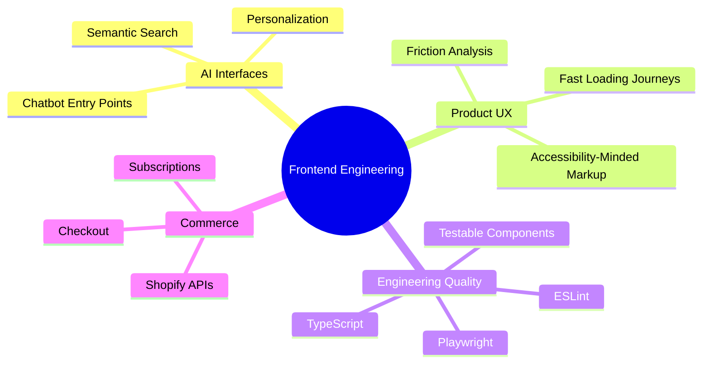

<div align="center">


<a href="mailto:amirali671@proton.me"></a>
<a href="https://linkedin.com/in/amirsaeed671"></a>
<a href="https://github.com/amir-healf"></a>


<br /><br />


</div>

---

## 👋 About me

I’m **Amir Ali**, a **Senior Frontend Engineer** based in **Karachi, Pakistan** and open to relocation. I have **5+ years of experience** building production-grade **React**, **Next.js** and **TypeScript** applications across AI-powered search, personalization, e-commerce, trading, SaaS dashboards and workflow products.

I care deeply about clean frontend architecture, fast interfaces, privacy-first product thinking, user trust and turning complex product requirements into responsive, reliable experiences.

---

## ✨ What I build

<table>
<tr>
<td width="50%">

### 🔎 AI Search & Discovery
- Semantic AI search experiences
- Fuzzy matching and recent searches
- Personalized discovery journeys
- Collection and product search infrastructure

</td>
<td width="50%">

### 🧠 Personalization & Onboarding
- AI-powered onboarding flows
- Quiz, chatbot and wearable journeys
- Signal-driven product experiences
- Klaviyo sync and user segmentation flows

</td>
</tr>
<tr>
<td width="50%">

### 🛒 Commerce & Subscriptions
- Shopify-powered checkout experiences
- Subscription flows and sensitive actions
- REST and GraphQL integrations
- Secure server-side validation patterns

</td>
<td width="50%">

### 📊 Dashboards & Workflow Platforms
- SaaS dashboards and internal tools
- Trading and investment interfaces
- Booking and payment systems
- Operational workflow automation

</td>
</tr>
</table>

---

## 🚀 Impact highlights

<div align="center">

| Area | Result |
|---|---|
| **Frontend performance** | Reduced React dashboard load time by **50%** through refactoring, performance optimization and cleaner UI architecture |
| **Workflow automation** | Reduced operational workflow time by **50%** for a German road-inspection client by replacing Excel-based processes with a React platform |
| **AI product UX** | Shipped semantic AI search, fuzzy matching, personalized discovery, AI onboarding and chatbot entry points |
| **Code quality** | Built ESLint tooling and migrated frontend modules from JavaScript to TypeScript across large monorepo applications |
| **Production ownership** | Owned frontend delivery from scoping and architecture through polished release across search, onboarding, checkout and personalization journeys |
| **Trust & reliability** | Worked on security-sensitive frontend/backend integration, typed data flows and secure validation for sensitive subscription actions |

</div>

---

## 🧰 Tech stack

<div align="center">


<br /><br />


</div>

### Core strengths

```txt
Frontend       React - Next.js - TypeScript - JavaScript - Tailwind CSS - Responsive UI
Architecture   Production-ready components - Modern frontend architecture - Typed data flows
APIs & Data     REST - GraphQL - Shopify APIs - Supabase - MongoDB - Node.js - Express.js
Quality         Playwright - ESLint - GitHub - Code reviews - Documentation - Testable UI
UX & Product    Figma collaboration - Pixel-accurate UI - A/B testing - PostHog analytics
AI Products     Semantic search - Fuzzy matching - Personalized discovery - AI onboarding
```

---

## 💼 Experience

### 🟣 Senior Frontend Engineer — Healf
**Jul 2025 - Present · Remote**

- Own end-to-end frontend delivery for search, onboarding, subscription, checkout and personalization journeys using **React**, **Next.js**, **TypeScript** and **Shopify**.
- Designed and shipped **Search 2.0** experiences including semantic AI search, fuzzy matching, personalized discovery, recent searches and collection infrastructure.
- Built AI-powered onboarding and personalization flows including quizzes, chatbot entry points, wearable journeys and Klaviyo sync systems.
- Integrated frontend components with backend services and commerce APIs using typed data flows, REST/GraphQL patterns and secure server-side validation.
- Improved user journeys through performance-conscious UI, controlled rollouts, A/B testing, PostHog analytics and proactive friction fixes.

### 🔵 Frontend Developer — Grappetite
**Jun 2024 - Jul 2025**

- Built reusable **React** and **TypeScript** component systems and scalable UI patterns for maintainable delivery.
- Translated design and backend requirements into polished, responsive interfaces.
- Contributed to frontend architecture, reusable abstractions, TypeScript patterns, refactoring and engineering workflows.

### 🟢 Frontend Developer — Deriv
**Mar 2023 - May 2024**

- Built internal **ESLint** tooling and migrated frontend modules from JavaScript to TypeScript across large monorepo applications.
- Contributed to shared frontend architecture and code-quality standards in an engineering environment of **50+ frontend engineers**.
- Worked on enterprise-scale trading applications focused on scalable UI, maintainability, performance and reliable user experiences.

### 🟠 Full Stack Developer — Upwork
**Aug 2019 - Jan 2023**

- Owned full-stack client projects from requirements and architecture to React implementation, backend integration, deployment and support.
- Reduced operational workflow time by **50%** for a German client by replacing Excel-based road inspection processes with a React inspection platform.
- Built booking, payment gateway, investment dashboard and data-driven frontend systems using **React**, **TypeScript**, **Node.js** and **Express**.

### 🟡 Frontend Developer — Secomind India
**Nov 2019 - Nov 2022**

- Reduced React dashboard load time by **50%** through frontend refactoring and performance optimization.
- Built cloud applications powering smart vending systems deployed in the US market.
- Developed provisioning dashboards used by Qualcomm for chipset device workflows.
- Migrated JavaScript applications to TypeScript and implemented Stripe integrations for scheduling platforms.

### ⚫ React Developer — Radical Stack Ltd
**Aug 2019 - Nov 2019**

- Built pixel-accurate, responsive React interfaces and integrated REST APIs for blockchain workflows.
- Developed frontend systems for decentralized application experiences with strong attention to UI quality and clean implementation.

---

## 🎯 Current focus



---

## 📚 Education

- **BS Computer Science** — Virtual University of Pakistan  
- **ICS, Computer Science** — Army Public College, Karachi  

---

## 📈 GitHub activity

<div align="center">


<br /><br />


</div>

---

## 🤝 Let’s build something polished

I enjoy partnering closely with product, design and backend teams to ship interfaces that are beautiful, fast, maintainable and reliable under real-world constraints.

<div align="center">

<a href="mailto:amirali671@proton.me"></a>
<a href="https://linkedin.com/in/amirsaeed671"></a>

<br /><br />


</div>
